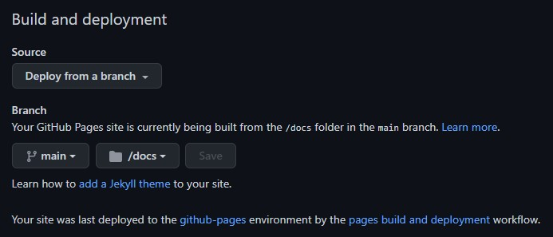

<!-- omit in toc -->
# KeM's Clew

kenkenpa198 の個人サイト [KeM's Clew](https://kems-clew.net) の実態ファイル群を管理しているリポジトリ。  
URL はこちら。

- [https://kems-clew.net](https://kems-clew.net)

以下の URL でもアクセスできる。  
すべて [https://kems-clew.net](https://kems-clew.net) へリダイレクトされる。

- [https://www.kems-clew.net](https://www.kems-clew.net)
- [http://kems-clew.net](http://kems-clew.net)
- [http://www.kems-clew.net](http://www.kems-clew.net)

## 1. 公開まわりの設定

### 1.1. 独自ドメインと DNS 設定

独自ドメイン `kems-clew.net` は 2022-11-11 に [Xserver Domain](https://www.xdomain.ne.jp/) で取得。

GitHub Pages の `A` レコード 及び `AAAA` レコードを Xserver Domain の DNS レコード設定に追加し、ドメインに来た通信を GitHub Pages の IP アドレスへ向けている。

### 1.2. GitHub Pages でのホスティング

サイトの実体は GitHub Pages でホスティングされている。  
元の URL は下記。

- [https://kenkenpa198.github.io/kems-clew.net/](https://kenkenpa198.github.io/kems-clew.net/)

`/docs` 配下がサイトの実体となるファイルを格納するディレクトリ。  
`main` ブランチに存在する`/docs` ディレクトリをビルド用ディレクトリとして設定している。



### 1.3. HTTPS 化

SSL 証明書は [Xserver SSL](https://ssl.xdomain.ne.jp/) にて発行。ブランドは `Let's Encrypt` 。  
HTTPS での公開は GitHub Pages の `Enforce HTTPS` を使用している。

## 2. Jekyll によるビルド

当サイトは HTML ソースのテンプレート化や [マークダウン記法でのブログ機能](https://kems-clew.net/notes.html) を実装している。  
これらは GitHub Pages に組み込まれている静的サイトジェネレータ「[Jekyll](http://jekyllrb-ja.github.io/)」の機能を使用している。

初回リリース時点で Jekyll の機能を使用しているのは以下のディレクトリ・ファイル。

- `/docs/_layouts/`
    - サイト全体で使用するテンプレートファイルを格納するディレクトリ。
    - 例えば `default.html` は `<head>` タグ及び `<body>` タグ内のヘッダーとフッター、後述のタグ `{{ content }}` などが記述された共通テンプレートファイル。
- `/docs/_posts/`
    - [Notes](https://kems-clew.net/notes.html) ページ配下にて公開されるブログの投稿ファイルを格納するディレクトリ。
    - 投稿はマークダウン形式のファイルとして作成・配置する。
    - ファイルそれぞれの先頭には後述の [YAML Front Matter](http://jekyllrb-ja.github.io/docs/front-matter/) が記述されている。
- `/docs/_config.yml`
    - Jekyll を使用したサイトのデフォルト設定値を定義するファイル。
- これらの他、ブレースホルダー `{ }` `{{ }}` や YAML 形式での記述がされたファイル。
    - オブジェクト

        ```html
        {{ content }}
        ```

        ```html
        {{ page.title }}
        ```

    - タグ

        ```html
        <ul class="myposts">
        
            <li>
                <span class="postDate">{{ post.date | date: "%Y-%m-%d" }}</span>
                <a href="{{ post.url }}">{{ post.title }}</a>
            </li>
        
        </ul>
        ```

    - フィルタ

        ```html
        <link rel="stylesheet" href="{{ "/assets/css/style.css" | relative_url }}">
        ```

    - YAML Front Matter （ファイルの先頭に記述）

        ```yml
        ---
        title: Home
        layout: default
        page-category: home
        ---
        ```

テンプレートとして利用されるファイルには `{{ content }}` を始めとしたオブジェクトやタグなどの記述が存在する。  
ソースとして利用されるファイルには YAML Front Matter が記述されている。

この YAML Front Matter 上に記述された情報やコンテンツ内容がブレースホルダー内の変数へ挿入され、HTML ファイルがビルドされるイメージ。

詳しくは Jekyll のチュートリアル用ページを参照。

- [セットアップ | Jekyll • シンプルで、ブログのような、静的サイト](https://jekyllrb-ja.github.io/docs/step-by-step/01-setup/)
- [HTMLサイトをJekyllに変換 | Jekyll • シンプルで、ブログのような、静的サイト](http://jekyllrb-ja.github.io/tutorials/convert-existing-site-to-jekyll/)

## 3. 使用ライブラリ

[Home](https://kems-clew.net/) や [Works](https://kems-clew.net/works.html) ページの画像レイアウト処理は以下の JavaScript ライブラリを使用している。

- [jQuery](https://jquery.com/)
- [Masonry](https://masonry.desandro.com/)
- [Colorbox](http://www.jacklmoore.com/colorbox/)

## 4. 参考文献

### 4.1. ドメインの取得～公開

- [Xserver Domain で取得したドメインを使って GitHub Pages で HTTPS に対応したサイトを公開する方法 – ktzwのエンジニアブログ](https://y-ktzw.com/posts/custom-domain/)

### 4.2. GitHub Pages / Jekyll

- [About custom domains and GitHub Pages - GitHub Docs](https://docs.github.com/ja/pages/configuring-a-custom-domain-for-your-github-pages-site/about-custom-domains-and-github-pages)
- [Jekyll • シンプルで、ブログのような、静的サイト | プレーンテキストを静的サイトやブログに変えましょう](http://jekyllrb-ja.github.io/)
- [Neos21/neos21.net: Repository of Neo's World](https://github.com/Neos21/neos21.net)

### 4.3. HTML / CSS / JS

- [jQuery最高の教科書｜株式会社シフトブレイン 著](http://jquery.shiftbrain.co.jp/)
- [CSS 最近のWebページやアプリのレイアウトに適した、ラッパーの実装テクニックを徹底解説 | コリス](https://coliss.com/articles/build-websites/operation/css/styling-layout-wrappers-in-css.html)
- [CSSでメディアクエリ(Media Queries)の基本的な書き方、記述の意味を理解し、「何となく使う」を卒業する。 | WEMO](https://wemo.tech/839)
- [【2022年】レスポンシブデザインのブレイクポイントまとめ｜どのデバイスでも綺麗に見える秘訣とは   ｜caroa design magazine](https://caroa.jp/design/article/IuBFNKUn)
- [スクロールバーの出現によるガタつきを防ぐCSS | q-Az](https://q-az.net/appear-scrollbar-problem/)
- [width,heighとpaddingの同時指定によるレイアウト崩れをbox-sizingdで防ぐ - Qiita](https://qiita.com/NeGI1009/items/a738cd96a345a7799e4b)
- [簡単にモーダルウィンドウを実装できるjQueryプラグイン「Colorbox」｜I'll be NET](https://illbenet.jp/view/js-colorbox)
