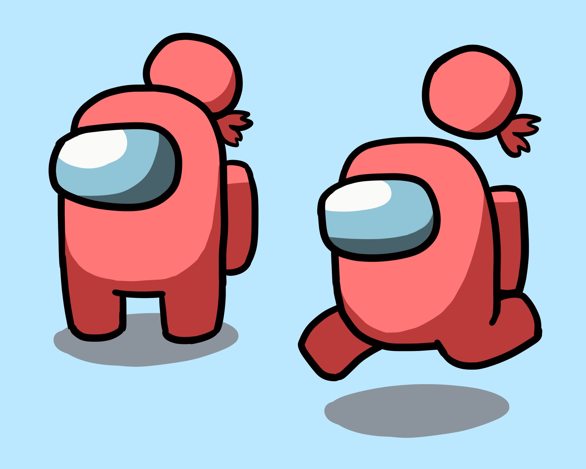

<!-- omit in toc -->
# Hello, World!

テスト用のマークダウンです。

## 1. 見出し 2

テキストテキストテキストテキストテキストテキストテキストテキストテキストテキストテキストテキストテキストテキスト

### 1.1. 見出し 3

コンテンツが長いコンテンツが長いコンテンツが長いコンテンツが長いコンテンツが長いコンテンツが長いコンテンツが長いコンテンツが長いコンテンツが長いコンテンツが長いコンテンツが長いコンテンツが長いコンテンツが長いコンテンツが長いコンテンツが長いコンテンツが長いコンテンツが長いコンテンツが長いコンテンツが長いコンテンツが長いコンテンツが長いコンテンツが長いコンテンツが長いコンテンツが長いコンテンツが長いコンテンツが長いコンテンツが長いコンテンツが長い

#### 1.1.1. 見出し 4

あいうえおーーーーーーーー

## 2. 改行テスト

### 2.1. 末尾にスペースなしで改行

テキストテキストテキストテキストテキスト
テキストテキストテキストテキストテキスト
テキストテキストテキストテキストテキスト

### 2.2. 末尾にスペースありで改行

テキストテキストテキストテキストテキスト  
テキストテキストテキストテキストテキスト  
テキストテキストテキストテキストテキスト  

## 3. 表

| あいうえお | かきくけこ | さしすせそ |
|------------|------------|------------|
| ねこ       | いぬ       | ごりら     |
| ねこ       | いぬ       | ごりら     |
| ねこ       | いぬ       | ごりら     |
| ねこ       | いぬ       | ごりら     |
| ねこ       | いぬ       | ごりら     |

| あいうえお | かきくけこ | さしすせそ                             |
|------------|------------|----------------------------------------|
| ねこ       | いぬ       | セル内改行<br>セル内改行<br>セル内改行 |
| ねこ       | いぬ       | ごりら                                 |
| ねこ       | いぬ       | ごりら                                 |
| ねこ       | いぬ       | ごりら                                 |
| ねこ       | いぬ       | ごりら                                 |

間にテキスト

| あいうえお | かきくけこ | さしすせそ | コンテンツが長いコンテンツが長いコンテンツが長いコンテンツが長いコンテンツが長いコンテンツが長いコンテンツが長い |
|------------|------------|------------|------------------------------------------------------------------------------------------------------------------|
| ねこ       | いぬ       | ごりら     | コンテンツが長いコンテンツが長いコンテンツが長いコンテンツが長いコンテンツが長いコンテンツが長いコンテンツが長い |
| ねこ       | いぬ       | ごりら     | コンテンツが長いコンテンツが長いコンテンツが長いコンテンツが長いコンテンツが長いコンテンツが長いコンテンツが長い |
| ねこ       | いぬ       | ごりら     | コンテンツが長いコンテンツが長いコンテンツが長いコンテンツが長いコンテンツが長いコンテンツが長いコンテンツが長い |
| ねこ       | いぬ       | ごりら     | コンテンツが長いコンテンツが長いコンテンツが長いコンテンツが長いコンテンツが長いコンテンツが長いコンテンツが長い |
| ねこ       | いぬ       | ごりら     | コンテンツが長いコンテンツが長いコンテンツが長いコンテンツが長いコンテンツが長いコンテンツが長いコンテンツが長い |

## 4. リスト

- リスト
- リスト
    - リスト
    - リスト
        - リスト
    - リスト
- リスト

1. 番号付きリスト
2. 番号付きリスト
    1. 番号付きリスト
    2. 番号付きリスト
        1. 番号付きリスト
    3. 番号付きリスト
3. 番号付きリスト

- [ ] チェックボックス
    - [ ] チェックボックス
        - [ ] チェックボックス

- コンテンツが長いコンテンツが長いコンテンツが長いコンテンツが長いコンテンツが長いコンテンツが長いコンテンツが長いコンテンツが長いコンテンツが長いコンテンツが長いコンテンツが長いコンテンツが長いコンテンツが長いコンテンツが長いコンテンツが長い
- コンテンツが長いコンテンツが長いコンテンツが長いコンテンツが長いコンテンツが長いコンテンツが長いコンテンツが長いコンテンツが長いコンテンツが長いコンテンツが長いコンテンツが長いコンテンツが長いコンテンツが長いコンテンツが長いコンテンツが長い
    - コンテンツが長いコンテンツが長いコンテンツが長いコンテンツが長いコンテンツが長いコンテンツが長いコンテンツが長いコンテンツが長いコンテンツが長いコンテンツが長いコンテンツが長いコンテンツが長いコンテンツが長いコンテンツが長いコンテンツが長い
        - コンテンツが長いコンテンツが長いコンテンツが長いコンテンツが長いコンテンツが長いコンテンツが長いコンテンツが長いコンテンツが長いコンテンツが長いコンテンツが長いコンテンツが長いコンテンツが長いコンテンツが長いコンテンツが長いコンテンツが長い

## 5. リンク

[Google](https://www.google.com/?hl=ja)

## 6. 画像



## 7. 罫線

罫線

---

罫線

---

罫線

## 8. HTML

<details><summary><b>読み上げを開始する</b></summary><div>

---

1. 参加させたいボイスチャンネルへ入室してください。
2. 読み上げさせたいテキストチャンネルで以下のコマンドのいずれかを入力して送信してください。

    ```text
    !mdn start
    ```

    ```text
    !mdn s
    ```

3. もだねちゃんがボイスチャンネルへ入室します。以降に読み上げ対象チャンネルへ投稿されたメッセージを読み上げてくれます🎤

---

</div></details>
